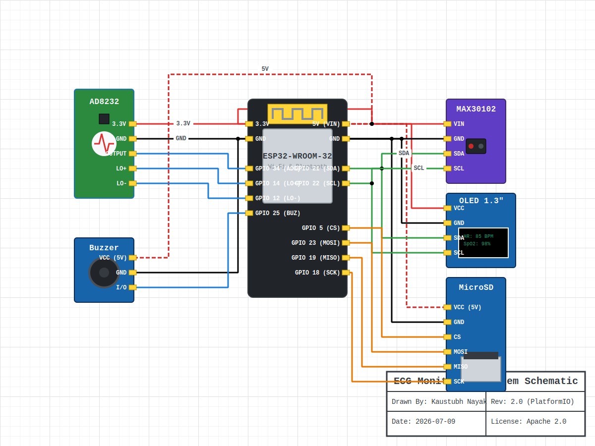

<div align="center">
  
  
  
  
  <br>
  <h1>ECG Monitoring System with Analog Signal Conditioning</h1>
  <p>A portable, low-cost biomedical monitoring device designed for continuous acquisition, processing, visualization, and remote transmission of physiological signals.</p>
</div>

---

## 📖 Project Overview

Unlike conventional IoT projects that simply interface sensors with a microcontroller, this project emphasizes **analog signal conditioning**, accurate physiological data acquisition, and reliable modular embedded C++ design. 

The ECG signal, which is typically in the range of a few millivolts, is conditioned using the **AD8232 analog front-end** before being digitized by the ESP32. Additional health parameters such as blood oxygen saturation (SpO₂) and heart rate are acquired simultaneously via the **MAX30102**, enabling multi-parameter patient monitoring.

The collected data is displayed locally on an OLED display, transmitted to the cloud via Wi-Fi (Blynk IoT) for remote access, and emergency notifications are sent instantly using a **Telegram Bot**. The system also supports high-speed offline data logging to a **microSD Card** to ensure reliability when network connectivity is unavailable.

---

## 🎯 Objectives

- **Acquire** low-amplitude ECG signals using an analog front-end.
- **Monitor** ECG, Heart Rate, and Blood Oxygen (SpO₂) simultaneously.
- **Visualize** physiological signals in real-time.
- **Enable** wireless remote monitoring over Wi-Fi.
- **Send** emergency alerts through Telegram Bot.
- **Log** data offline via high-speed SPI microSD storage.
- **Build** a low-cost and portable healthcare monitoring device.

---

## 🛠 Hardware Components

| Component | Purpose |
|-----------|---------|
| **ESP32-WROOM-32** | Main microcontroller |
| **AD8232 AFE** | ECG signal acquisition and conditioning |
| **MAX30102** | Heart Rate & SpO₂ Sensor |
| **1.3" OLED** | Local visualization |
| **Active Buzzer** | Emergency audio alerts |
| **microSD Module**| Offline data logging |
| **ECG Electrodes** | Bio-potential acquisition |
| **Power Bank** | Portable 5V power supply |

---

## 🏗 System Architecture

The project has been refactored into a highly modular **PlatformIO** C++ architecture.

```text
ESP32-ECG-Health-Monitor/
├── platformio.ini         (Dependency Management)
├── include/config.h       (Global Settings & Pins)
└── src/
    ├── main.cpp           (Main Loop)
    ├── ecg/               (AD8232 Logic)
    ├── oximeter/          (MAX30102 Logic)
    ├── display/           (OLED Logic)
    ├── storage/           (SD Card Logic)
    ├── network/           (Wi-Fi, Blynk, Telegram Logic)
    └── alerts/            (Buzzer Logic)
```

---

## 🔌 Hardware Schematic & Wiring

The following SVG diagram illustrates the exact hardware connections. A standalone file is also available in `docs/schematic.svg`.



---

## 🚀 Getting Started

This project uses **PlatformIO** for easy compilation and automatic dependency management.

1. **Install PlatformIO**: Install the PlatformIO IDE extension for VS Code.
2. **Clone the Repo**:
   ```bash
   git clone https://github.com/KaustubhNayak005/ESP32-ECG-Health-Monitor.git
   ```
3. **Configure Credentials**: Open `include/config.h` and update your Wi-Fi, Telegram, and Blynk credentials.
4. **Build and Upload**: Click the **Upload** button in PlatformIO. It will automatically download all required libraries (Blynk, Adafruit GFX, MAX30105, TelegramBot) and flash the ESP32.

---

## ⚡ Engineering Challenges & Skills

### Analog Electronics
- **AFE (Analog Front-End)**: Conditioning millivolt-level bio-potentials.
- **Noise Reduction**: Common-mode rejection and high/low-pass filtering.

### Embedded Systems
- **Modular C++**: Distributed, object-oriented firmware architecture.
- **Real-Time Sampling**: Non-blocking 250 Hz ADC acquisition.
- **Peripheral Interfacing**: SPI (SD Card), I2C (OLED, MAX30102), GPIO (Buzzer, Leads-off).

### IoT & Networking
- **Wi-Fi Connectivity**: Asynchronous cloud streaming via Blynk IoT.
- **Telegram APIs**: Secure SSL/TLS connections for emergency Webhook alerts.

---

## 📝 License

This project is licensed under the **Apache License 2.0**. See the [LICENSE](LICENSE) file for more details.

---

## 🔮 Future Enhancements
- Custom ECG Analog Front-End PCB
- Hardware 50 Hz Notch Filter
- AI-based Arrhythmia Detection
- BLE Connectivity & Wearable Form Factor
- Multi-lead ECG Acquisition
